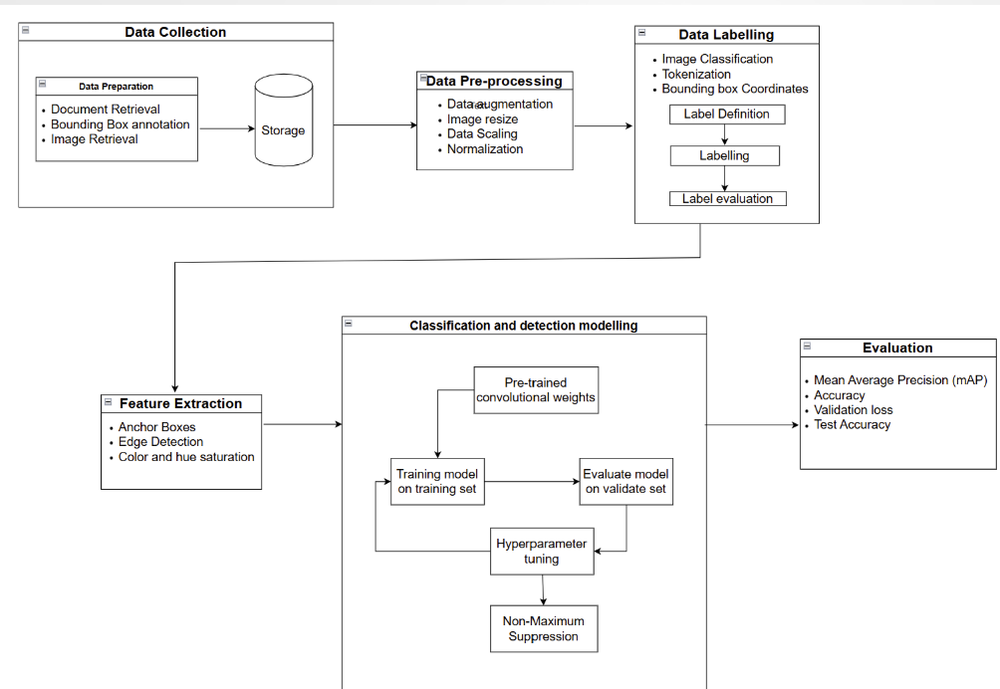
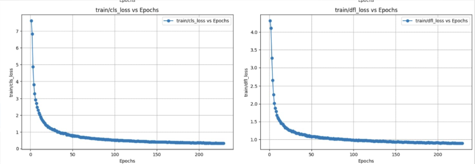
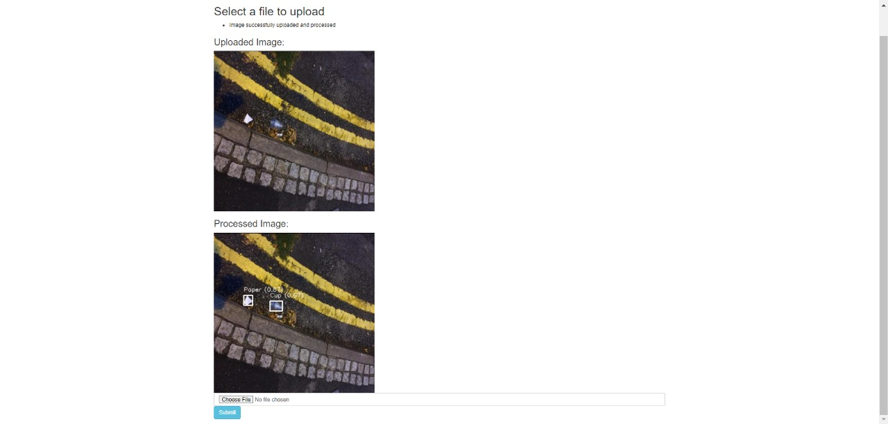

# Waste Detection and Classification

## Overview

Waste detection and classification is an AI-driven system that leverages deep learning models to automatically detect and classify various types of waste. This project is implemented using the **YOLO v10** model and the **TACO (Trash Annotations in Context) dataset** to enhance waste segregation efficiency. The system aims to improve recycling processes, reduce manual labor, and optimize waste management through automation.

## Features

- **Real-time Object Detection:** Identifies waste materials using the YOLO v10 model.
- **Waste Classification:** Categorizes waste into predefined types such as plastic, paper, metal, glass, aluminum, and organic.
- **Data Augmentation:** Uses Albumentations to enhance dataset diversity.
- **User Interface:** A Flask-based web app for image uploads and waste detection.
- **Model Evaluation:** Performance metrics include mAP (Mean Average Precision), precision, recall, and validation accuracy.

Detailed Design



## Installation & Setup

### Prerequisites

- Python 3.8+
- PyTorch
- OpenCV
- Flask
- Albumentations
- Google Colab (optional for training)

### Steps

1. Clone the repository:
   ```sh
   git clone https://github.com/your-repo/waste-detection.git
   cd waste-detection
   ```
2. Install dependencies:
   ```sh
   pip install -r requirements.txt
   ```
3. Run the web app:
   ```sh
   python web_app/app.py
   ```
4. Upload an image to classify waste.

## Model Training

1. Download the TACO dataset:
   ```sh
   !pip install kaggle
   !kaggle datasets download -d vencerlanz09/taco-dataset-yolo-format
   ```
2. Preprocess data using **Albumentations** transformations:
   - Horizontal Flip
   - Rotation
   - Brightness/Contrast Adjustments
   - Hue/Saturation Adjustments
3. Unzip and Prepare Data:
   ```sh
   import os
   import shutil
   from zipfile import ZipFile

   zip_file_path = '/content/taco-dataset-yolo-format.zip'
   destination_folder = '/content/drive/My Drive/Waste Detection and Classification/'
   os.makedirs(destination_folder, exist_ok=True)

   with ZipFile(zip_file_path, 'r') as zip_ref:
       zip_ref.extractall(destination_folder)
   ```
4. Train the YOLO v10 model:
   ```python
   from ultralytics import YOLO

   # Load YOLO v10 model
   model = YOLO('yolov10.yaml')

   # Train the model
   model.train(
       data='dataset.yaml',  # Dataset configuration file
       epochs=50,            # Number of training epochs
       batch=16,             # Batch size
       imgsz=640,            # Image size
       device='cuda',        # Use GPU if available
       augment=True          # Enable data augmentation
   )
   ```
5. Evaluate the model:
   ```python
   model.val()
   ```

## Testing & Results

- Model Performance:
  - **YOLO v10 Accuracy:** 81.5%
  - **YOLO v8 Accuracy:** 76.5%
- Metrics:
  - Mean Average Precision (mAP)
  - Precision & Recall
  - Loss Reduction Analysis
- Graph Comparison:
  - YOLO v10 outperformed YOLO v8 in stability and accuracy.
  - mAP50 improved significantly with better dataset augmentation.

## Evaluation Graphs

### YOLO v10 Performance




## Frontend

### Web Application Interface




## Tools & Technologies Used

- **Deep Learning Model:** YOLO v10
- **Dataset:** TACO Dataset
- **Frameworks:** PyTorch, Flask
- **Libraries:** OpenCV, Albumentations, Matplotlib, Ultralytics
- **Deployment:** Google Colab, Local Flask Server


## Contributors

- **Samraat Dabolay**
- **Sanjana Shetty**
- **Sanjana Suresh**
- **Shlok Shivaram Iyer**


